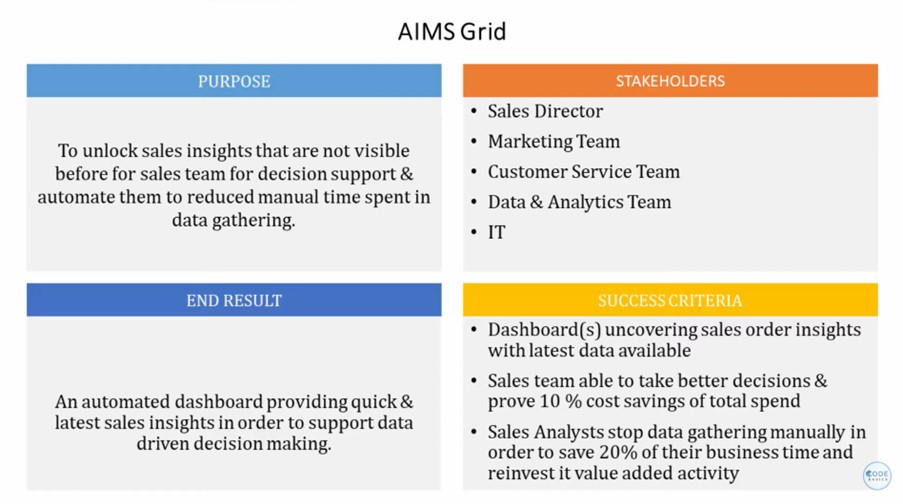

# **Sales insights project Powerbi Dashboard**
This repository contains a Power BI project that provides comprehensive sales insights through interactive dashboards. The project involves extracting, transforming, and loading (ETL) sales data using MySQL Workbench and visualizing the data in Power BI.
## Project Overview
- AtliQ hardware is a company which delivers computer hardware & peripheral Manufacturers to his clients, which has several branches throughout India. The sales director of the company is facing a lot of issues in terms of understanding how the business is performing and what are all the problem company is facing currently as the sales are not as expected and declining gradually. And whenever he calls the regional managers to get the current status of the sales and market, as a human behaviour, these people Humans are not comfortable in consuming numbers from excel files, which is obvious reason for the frustration.
- Sales director of the AltiQ hardware, decided to build a PowerBI Dashboard for converting the data into visual representation to make data driven decisions. So, he hired a team of data people to complete this task.
## AIMS Grid
This section describes the AIMS Grid methodology utilized in this project for analyzing sales data. AIMS (Analysis, Insights, Metrics, Strategy) Grid is a framework designed to structure the process of turning raw data into actionable business intelligence. Here's how it was applied:

1. **Analysis:**
   - Collected and cleaned sales data using MySQL Workbench.
   - Conducted detailed analysis to identify key patterns and anomalies in the data.

2. **Insights:**
   - Extracted meaningful insights from the data analysis.
   - Identified trends such as seasonal sales variations and high-performing regions.

3. **Metrics:**
   - Defined key performance indicators (KPIs) to measure sales success.
   - Metrics included total sales, average transaction value, and sales growth rate.

4. **Strategy:**
   - Developed strategies based on insights and metrics to improve sales performance.
   - Recommended actionable steps for marketing, inventory management, and customer engagement.

